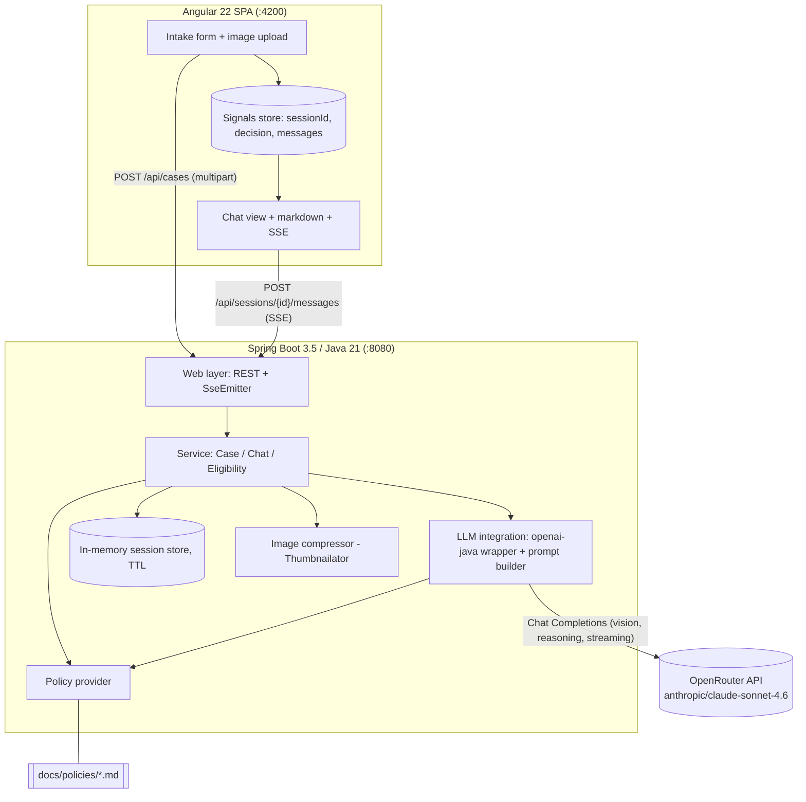
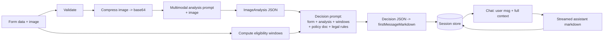
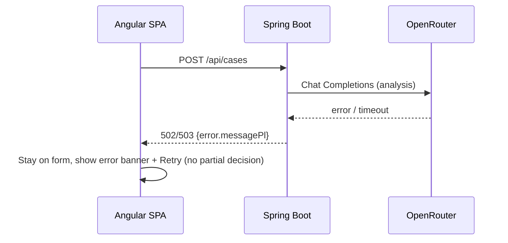

# ADR: Hardware Service Decision Copilot — Main Architecture

**Date:** 2026-06-24
**Status:** Accepted
**PRD:** [`docs/PRD-Product-Requirements-Document.md`](../PRD-Product-Requirements-Document.md)

---

## 1. Overview

This ADR set defines the technical architecture for the **Hardware Service Decision Copilot** MVP described in the PRD: a self-service web app where a customer submits an electronics complaint/return form with one photo, receives an AI decision (Approve / Reject / Escalate) with a policy-grounded justification, and then chats with the agent.

The system is a **two-tier web application**: an Angular single-page app (form + chat) talking to a Spring Boot REST/SSE backend, which orchestrates two LLM calls (multimodal image analysis, then a reasoning decision) through **OpenRouter** using the official **openai-java** SDK. This document covers the overall system, component map, cross-cutting decisions, data models, API contracts, environment, and the system-wide test strategy. Per-area detail lives in the granular ADRs:

- [`001-backend.md`](001-backend.md) — Spring Boot application structure, endpoints, session store, image handling.
- [`002-frontend.md`](002-frontend.md) — Angular app, chat UI, SSE consumption, form/upload.
- [`003-llm-integration.md`](003-llm-integration.md) — openai-java + OpenRouter, prompts, Chat-Completions-vs-Responses decision, streaming, structured output.

---

## 2. Context7 Library References

Implementing agents must fetch docs via these handles (run `resolve-library-id` only if a handle 404s).

| Library | Context7 Handle | Used for |
|---|---|---|
| Spring Boot | `/spring-projects/spring-boot` | Backend framework, REST controllers, SSE, config |
| openai-java SDK | `/openai/openai-java` | LLM client (Chat Completions, vision, streaming) |
| Angular | `/angular/angular` | Frontend SPA framework (standalone, signals, zoneless) |
| Angular Material / CDK | `/angular/components` | UI component primitives, CDK scroll |
| ngx-markdown | `/jfcere/ngx-markdown` | Render the markdown decision/chat messages |
| Jackson | `/fasterxml/jackson` | Parse LLM JSON output, serialize API DTOs |
| Thumbnailator | `/coobird/thumbnailator` | Server-side image compression/resize |

---

## 3. System Architecture

### Architecture pattern
SPA + stateless-per-request REST/SSE backend. The backend holds **ephemeral in-memory session state** (no database in the MVP) behind a repository abstraction so the planned SQLite persistence (PRD §12) can be added without changing callers. No reactive stack: Spring **MVC** with `SseEmitter`, kept blocking-friendly because the planned persistence (SQLite) is blocking JDBC.

### Repository structure
Polyglot monorepo under `app/`:

```
app/
  backend/        Spring Boot (Maven), Java 21, packaged via Maven Wrapper (mvnw)
    src/main/java/...        application code
    src/main/resources/      application.yml, prompt templates, bundled policy docs
    src/test/java/...        JUnit 5 tests
    pom.xml
    mvnw, mvnw.cmd
  frontend/       Angular 22 + Angular Material (npm)
    src/app/...              standalone components, services
    package.json
docs/
  policies/       Polish company policy docs injected into LLM prompts (already present)
```

The two builds are independent. Backend serves the API on `:8080`; frontend dev server runs on `:4200` and calls the backend cross-origin (CORS configured for local dev).

### Technology stack

| Layer | Technology | Reason |
|---|---|---|
| Frontend | Angular 22.0.2 + Angular Material 22.0.2 (TypeScript, SCSS, standalone, zoneless, signals) | Mandated; current stable; signals fit incremental SSE rendering |
| Markdown | ngx-markdown 22.0.0 | Active, Angular-version-tracked, MIT; renders formatted decision messages |
| Backend | Spring Boot 3.5.x, Java 21 (built on installed JDK 25 via `--release 21`) | Mandated; stable LTS-aligned; MVC + SseEmitter for streaming relay |
| Build | Maven (via Maven Wrapper) / npm | Mandated (Maven); no global Maven/Angular-CLI install required |
| LLM client | openai-java 4.41.0 | Mandated; supports OpenRouter base-URL override, vision, streaming |
| LLM gateway | OpenRouter (`https://openrouter.ai/api/v1`) | Mandated; routes to Anthropic Claude models |
| LLM model | `anthropic/claude-sonnet-4.6` (vision + reasoning), env-overridable | Strong multimodal + reasoning for decision-with-justification |
| Image processing | Thumbnailator | Compress/resize the uploaded image before the multimodal call |
| Session store | In-memory map with TTL behind a repository interface | PRD defers DB; abstraction enables SQLite later without rework |
| Testing | JUnit 5 + Mockito + MockWebServer (BE), Karma/Jasmine (FE), Playwright (E2E) | Per course conventions and PRD scope |

---

## 4. Module Structure & Dependencies

Backend modules (packages) — dependency direction points downward (web → service → integration); no cycles:

| Module | Responsibility | Depends on | Depended on by |
|---|---|---|---|
| `web` (controllers, DTOs, exception handlers) | HTTP/SSE endpoints, request validation, DTO mapping | `domain`, `service` | — |
| `service` (CaseService, ChatService, EligibilityService) | Orchestrates flow: validate → compress → analyze → compute windows → decide; manages chat turns | `domain`, `integration`, `policy`, `session` | `web` |
| `integration` (LLM client wrapper, prompt builder) | Wraps openai-java; builds vision/decision/chat prompts; parses JSON output; streams | `domain`, `policy` | `service` |
| `policy` (PolicyProvider) | Loads complaint/return policy docs + legal-rule text for prompt injection | — | `service`, `integration` |
| `session` (SessionRepository + InMemory impl) | Stores sessions/decisions/messages with TTL | `domain` | `service` |
| `domain` (enums, records, value objects) | RequestType, EquipmentCategory, DecisionCategory, CaseData, ImageAnalysis, EligibilityWindows, Session, ChatMessage | — | all |
| `config` | Beans (OpenAIClient, OpenAIClientAsync, CORS, multipart limits, virtual threads) | `integration`, `session` | bootstrap |

Frontend modules:

| Module | Responsibility | Depends on |
|---|---|---|
| `intake-form` component | Form, validation, single-image upload + preview, submit | `case-api` service, `app-state` |
| `chat` component | Render message list, send messages, render streamed markdown, decision badge | `chat-stream` service, `app-state`, ngx-markdown |
| `case-api` service | POST multipart case submission, GET metadata | HttpClient/fetch |
| `chat-stream` service | POST chat message, consume SSE via fetch+ReadableStream into signals | fetch |
| `app-state` (signals store) | Holds sessionId, case summary, decision category, messages | — |

---

## 5. Data Models

Conceptual entities (field types are conceptual, not schema):

- **CaseData** — the submitted form. Fields: `requestType` (enum COMPLAINT|RETURN), `equipmentCategory` (enum), `equipmentName` (string), `purchaseDate` (date), `reason` (string, required for COMPLAINT, optional for RETURN). Persistence: in session (no raw image retained after analysis).
- **EquipmentCategory** — enum: LAPTOP, DESKTOP, MONITOR, PERIPHERALS, PC_COMPONENTS, NETWORKING, ACCESSORIES, OTHER (Polish display labels supplied by the backend metadata endpoint).
- **EligibilityWindows** — computed from `purchaseDate` and the current date. Fields: `daysSincePurchase` (int), `withinWithdrawalWindow` (bool, ≤14 days), `withinNonConformityWindow` (bool, ≤2 years). Persistence: in session.
- **ImageAnalysis** — structured output of the multimodal call. Fields (superset; populated per scenario): `damaged` (tri-state true/false/uncertain), `damageType` (string|null), `damageLocation` (string|null), `likelyCause` (string|null), `resellableAsNew` (tri-state, return scenario), `signsOfUse` (string|null), `confidence` (enum LOW|MEDIUM|HIGH), `summary` (string). Persistence: in session.
- **Decision** — output of the decision agent. Fields: `category` (enum APPROVE|REJECT|ESCALATE), `justificationMarkdown` (string), `nextStepsMarkdown` (string), `citedRules` (list of strings), `firstMessageMarkdown` (assembled greeting + decision + justification + next steps + disclaimer). Persistence: in session.
- **ChatMessage** — Fields: `role` (enum USER|ASSISTANT|SYSTEM), `content` (string, markdown for assistant), `timestamp`. Persistence: in session (ordered list).
- **Session** — Fields: `sessionId` (UUID), `caseData`, `eligibilityWindows`, `imageAnalysis`, `decision`, `currentDecisionCategory` (mutable; may move REJECT→ESCALATE in chat), `messages` (list), `createdAt`, `expiresAt`. Persistence: in-memory map keyed by `sessionId`, evicted after TTL (default 60 min).

The **raw image** is never persisted: it is compressed, base64-encoded, sent to the multimodal model, and discarded after the `ImageAnalysis` is produced.

---

## 6. API / Interface Contracts

Base path `/api`. All responses JSON unless noted. User-facing text Polish; field names/enums English.

| Endpoint | Input | Output | Errors | Notes |
|---|---|---|---|---|
| `POST /api/cases` | `multipart/form-data`: `requestType`, `equipmentCategory`, `equipmentName`, `purchaseDate`, `reason` (optional for return), `image` (JPEG/PNG ≤5MB) | `201`: `{ sessionId, decisionCategory, firstMessageMarkdown, caseSummary{requestType, equipmentCategory, equipmentName, decisionCategory} }` | `400` validation (missing/invalid field, missing reason for complaint, future date, wrong image type/size); `502/503` LLM/timeout | Synchronous: runs compress → multimodal analysis → window computation → decision. The loading state in the UI covers it. No partial result on failure. |
| `POST /api/sessions/{id}/messages` | `application/json`: `{ message }` | `200` `text/event-stream`: incremental `data:` token events, terminal `data: [DONE]`; a final event carries `{ decisionCategory }` if it changed | `404` unknown/expired session; `400` empty message; `502/503` LLM | SSE relay of the chat stream. Agent retains full session context. May move REJECT→ESCALATE, never REJECT→APPROVE. |
| `GET /api/sessions/{id}` | path id | `200`: full session view (case summary, decision, messages) | `404` | Lets the SPA recover state; sessions are not durable across server restart. |
| `GET /api/meta/form-options` | — | `200`: `{ requestTypes[], equipmentCategories[] }` with `{value, labelPl}` | — | Lets the form render Polish labels without hardcoding. |
| `GET /api/health` | — | `200`: `{ status: "UP" }` | — | Liveness for local dev. |

Error envelope: `{ error: { code, messagePl, fieldErrors?: [{field, messagePl}] } }`.

---

## 7. Environment Variables

`.env.example` at the repo root is the source of truth (it is permission-locked in this environment; confirm exact names against it). The application requires at minimum an OpenRouter key.

| Variable | Purpose | Required | Example value |
|---|---|---|---|
| `OPENROUTER_API_KEY` | Auth for OpenRouter (`Authorization: Bearer`) | Yes | `sk-or-v1-...` |
| `OPENROUTER_BASE_URL` | LLM gateway base URL | No (default) | `https://openrouter.ai/api/v1` |
| `LLM_MODEL_VISION` | Model ID for multimodal analysis | No (default) | `anthropic/claude-sonnet-4.6` |
| `LLM_MODEL_DECISION` | Model ID for the decision + chat | No (default) | `anthropic/claude-sonnet-4.6` |
| `APP_PUBLIC_URL` | Sent as `HTTP-Referer` (OpenRouter attribution) | No | `http://localhost:4200` |
| `APP_TITLE` | Sent as `X-Title` (OpenRouter attribution) | No | `NBP Hardware Service Decision Copilot` |
| `SERVER_PORT` | Backend port | No (default) | `8080` |
| `CORS_ALLOWED_ORIGINS` | Allowed SPA origin(s) | No (default) | `http://localhost:4200` |
| `SESSION_TTL_MINUTES` | In-memory session lifetime | No (default) | `60` |
| `IMAGE_MAX_BYTES` | Reject larger uploads | No (default) | `5242880` |

> Note: `OPENAI_API_KEY` (per AGENTS.md) is an accepted alternative only if the base URL is repointed to OpenAI directly; for this project OpenRouter is the gateway, so `OPENROUTER_API_KEY` is primary.

---

## 8. Technical Decisions

### Spring MVC + SseEmitter (not WebFlux)
**Status:** Accepted
**Date:** 2026-06-24
**Context:** Chat replies must stream to the browser. The openai-java async client (`OpenAIClientAsync`) already delivers stream chunks on its own threads, and the planned persistence layer is SQLite (blocking JDBC, no production-grade reactive driver).
**Decision:** Use Spring MVC with `SseEmitter`, fed by the async SDK client's `subscribe` callback, with Java 21 virtual threads enabled. This relays the stream without blocking a platform thread and keeps a simple, blocking-friendly model compatible with future SQLite.
**Rejected alternatives:**
- *Spring WebFlux + `Flux<ServerSentEvent>`*: cleaner reactive mapping, but commits the whole app to a reactive stack that clashes with blocking SQLite and adds complexity unjustified for an MVP demo (low concurrency).
- *Plain blocking SseEmitter on platform threads*: ties up a thread per active stream; avoided by using the async client + virtual threads.
**Consequences:** (+) Simple, familiar to Java devs; future SQLite fits naturally. (−) No reactive backpressure (acceptable at demo scale).
**Review trigger:** If concurrent active streams exceed a few hundred, or if a reactive datastore is adopted.

### Chat Completions API (not the Responses API)
**Status:** Accepted
**Date:** 2026-06-24
**Context:** openai-java exposes both `client.responses()` and `client.chat().completions()`. OpenRouter's Responses API is explicitly **beta** with warned breaking changes; Chat Completions is stable for Anthropic models via OpenRouter.
**Decision:** Use the Chat Completions API (`createStreaming` for chat, synchronous `create` for analysis/decision). See [`003-llm-integration.md`](003-llm-integration.md).
**Rejected alternatives:** *Responses API* — beta on OpenRouter, no functional advantage here (OpenRouter is stateless regardless), risky for a live course demo.
**Consequences:** (+) Stability, documented vision + streaming. (−) We manage conversation state ourselves (already required, since OpenRouter is stateless).
**Review trigger:** If OpenRouter promotes the Responses API to stable and we need server-side conversation state.

### In-memory session store behind a repository interface
**Status:** Accepted
**Date:** 2026-06-24
**Context:** PRD defers persistence (§7) but lists DB-backed sessions as planned backlog (§12); chat needs server-side continuity.
**Decision:** Implement `SessionRepository` with an in-memory TTL-based implementation now; the planned SQLite implementation drops in later.
**Rejected alternatives:** *SQLite now* — out of PRD MVP scope, extra work. *Stateless/client-held history* — larger payloads, image-analysis context would have to round-trip from the browser; weaker control.
**Consequences:** (+) Minimal MVP work, clean upgrade path. (−) Sessions lost on restart (acceptable; documented in PRD §9.2).
**Review trigger:** When backlog item "session & decision persistence" is scheduled.

### Prompt-instructed JSON output (not SDK structured-output binding) for the analyzer & decision
**Status:** Accepted
**Date:** 2026-06-24
**Context:** openai-java's `responseFormat(Class<T>)` relies on OpenAI native structured outputs; pass-through to Claude via OpenRouter is unconfirmed (OpenRouter silently ignores unsupported params).
**Decision:** Instruct the model (in the prompt) to return strict JSON for `ImageAnalysis` and `Decision`, then parse with Jackson, with a tolerant parse + one re-ask on malformed JSON. The user-facing chat reply is free-form markdown (no JSON).
**Rejected alternatives:** *SDK structured output* — not reliably supported for Claude-via-OpenRouter.
**Consequences:** (+) Works with any model/provider. (−) Must handle occasional malformed JSON (mitigated by re-ask + ESCALATE fallback).
**Review trigger:** If a future model/provider reliably supports schema-constrained output through OpenRouter.

### Synchronous first decision, streamed chat
**Status:** Accepted
**Context:** The first decision needs two sequential LLM calls (vision then reasoning); the form already shows a loading state.
**Decision:** `POST /api/cases` returns the complete first decision message; only follow-up chat streams over SSE.
**Rejected alternatives:** *Stream the first decision too* — more moving parts for marginal UX gain during a one-time spinner.
**Consequences:** (+) Simpler initial flow, atomic success/failure. (−) Slightly longer single wait before navigation (covered by the loading state).
**Review trigger:** If first-decision latency becomes a UX problem.

---

## 9. Diagrams

### 9.1 Architecture / Component Diagram


### 9.2 Data Flow Diagram


### 9.3 Sequence Diagrams

#### Form submission → first decision (happy path)
```mermaid
sequenceDiagram
    participant U as User
    participant FE as Angular SPA
    participant BE as Spring Boot
    participant IMG as Image compressor
    participant OR as OpenRouter (Claude)
    participant S as Session store
    U->>FE: Fill form + attach photo, submit
    FE->>FE: Client-side validation (type/size/required)
    FE->>BE: POST /api/cases (multipart)
    BE->>BE: Server-side validation
    BE->>IMG: Compress + base64-encode image
    BE->>OR: Chat Completions (vision analysis prompt + image)
    OR-->>BE: ImageAnalysis (JSON)
    BE->>BE: Compute eligibility windows
    BE->>OR: Chat Completions (decision prompt: form+analysis+windows+policy+law)
    OR-->>BE: Decision (JSON)
    BE->>S: Create session (case, analysis, decision, first message)
    BE-->>FE: 201 {sessionId, decisionCategory, firstMessageMarkdown}
    FE->>U: Navigate to chat; render first decision bubble
```

#### Chat follow-up (streaming) + possible escalation
```mermaid
sequenceDiagram
    participant U as User
    participant FE as Angular SPA
    participant BE as Spring Boot
    participant S as Session store
    participant OR as OpenRouter (Claude)
    U->>FE: Type message, send
    FE->>BE: POST /api/sessions/{id}/messages (JSON)
    BE->>S: Load full session context
    BE->>OR: Chat Completions streaming (history + system rules)
    loop token stream
        OR-->>BE: chunk
        BE-->>FE: SSE data: <token>
        FE->>U: Append token to assistant bubble (markdown)
    end
    OR-->>BE: stream end
    BE->>S: Append assistant message; update decisionCategory if REJECT->ESCALATE
    BE-->>FE: SSE data: {decisionCategory?} then data: [DONE]
    FE->>U: Update decision badge if changed
```

#### Error path (LLM/timeout on submission)


---

## 10. Testing Strategy

### Philosophy
TDD per `AGENTS.md`: write/extend tests before production code, confirm they fail for the right reason, implement minimally, keep green. The LLM is the only mocked external dependency at integration level; unit tests mock all dependencies; E2E runs the real stack with the LLM reachable (or a stubbed gateway for deterministic runs).

### Test layers

| Layer | Type | Scope | Tools |
|---|---|---|---|
| Unit | Isolated | Validation, eligibility-window math, prompt building, JSON parsing, decision-category rules, session store TTL | JUnit 5, Mockito (BE); Karma/Jasmine (FE) |
| Integration | Component + mocked LLM | Controllers + service wiring with the LLM HTTP boundary mocked | JUnit 5, Spring Boot Test, MockWebServer |
| E2E | Real stack | Full form→decision→chat flow in a browser | Playwright (qa-engineer) |

### Key test scenarios
- **Complaint Approve happy path** — valid complaint + damage photo → `APPROVE`, justification cites complaint policy + 2-year window; first message has all five sections + disclaimer.
- **Return Reject (out of window)** — purchase date 20 days ago → return biased to `REJECT`/`ESCALATE`; justification states out-of-window. Edge: exactly 14 days (boundary inclusive).
- **Ambiguous image → Escalate** — analyzer reports LOW confidence → `ESCALATE`. Edge: unreadable image.
- **Validation failures** — missing image; non-JPEG/PNG; >5MB; missing reason for complaint; future purchase date → `400` with field errors, no LLM call.
- **Chat cannot upgrade Reject→Approve** — after a `REJECT`, user pushes for approval → reply stays non-approving; may move to `ESCALATE` only with credible new info.
- **LLM failure** — gateway error/timeout on submission → `502/503`, no partial decision, UI shows retry.
- **Session expiry** — chat after TTL → `404`.
- **SSE streaming** — chat returns incremental events ending with `[DONE]`; client renders progressively.
- **Off-topic** — unrelated question → polite redirect.
- **Polish output** — decision and chat text are Polish; disclaimer present.

### Technical acceptance criteria
- **TAC-01:** `POST /api/cases` with any invalid field returns `400` and performs zero LLM calls (verified via mock).
- **TAC-02:** Eligibility-window computation is correct at boundaries: 14 days and 730 days inclusive (unit-tested).
- **TAC-03:** A malformed-JSON LLM analysis/decision triggers exactly one re-ask; persistent malformation yields `ESCALATE` (analysis) or `502` (no decision), never a blank decision.
- **TAC-04:** The chat endpoint emits `text/event-stream` and terminates every successful stream with a `[DONE]` sentinel.
- **TAC-05:** No raw image bytes are retained in the session store after analysis (verified by inspecting stored session state).
- **TAC-06:** Backend builds and tests pass on JDK 25 targeting `--release 21`; frontend `ng build` and unit tests pass on Node 24.
- **TAC-07:** CORS permits the configured SPA origin and rejects others.
- **TAC-08:** A `REJECT` session never transitions to `APPROVE` through the chat endpoint (state-machine test).
