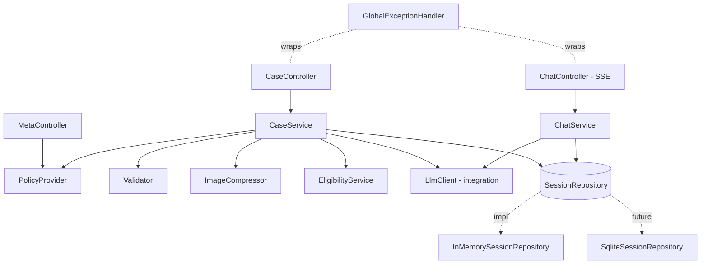
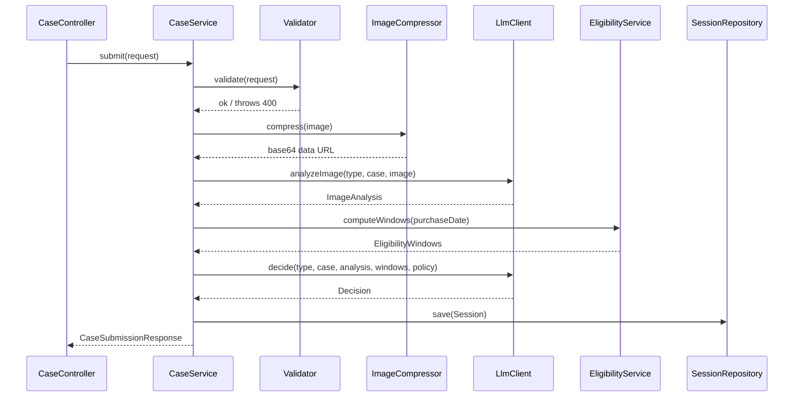

# ADR-001: Backend (Spring Boot)

**Date:** 2026-06-24
**Status:** Accepted
**Relates to:** [`000-main-architecture.md`](000-main-architecture.md)

---

## 1. Scope

Covers the Spring Boot backend: application structure, REST/SSE endpoints, request validation, image compression, eligibility-window computation, the in-memory session store, configuration, and error handling. **Does not cover** the LLM client/prompts (see [`003-llm-integration.md`](003-llm-integration.md)) or the frontend (see [`002-frontend.md`](002-frontend.md)).

---

## 2. Context7 References

| Library | Context7 Handle | Used for |
|---|---|---|
| Spring Boot | `/spring-projects/spring-boot` | Web layer, validation, SSE, config, virtual threads |
| Jackson | `/fasterxml/jackson` | DTO (de)serialization, LLM JSON parsing |
| Thumbnailator | `/coobird/thumbnailator` | Image compression/resize |
| openai-java | `/openai/openai-java` | (consumed via integration module) |

---

## 3. Component Design

Layered, single deployable JAR. Dependency direction: `web → service → integration/session/policy → domain`.

- **Web layer** — REST controllers + one SSE controller; `@RestControllerAdvice` global exception handler producing the Polish error envelope; Bean Validation on request DTOs; multipart handling for `POST /api/cases`.
- **Service layer**
  - `CaseService` — orchestrates submission: validate → compress image → request image analysis → compute eligibility windows → request decision → create session → return first message.
  - `ChatService` — loads session, appends the user turn, requests a streamed reply, relays chunks to the `SseEmitter`, appends the assistant turn, applies the REJECT→ESCALATE state rule.
  - `EligibilityService` — pure date math producing `EligibilityWindows`.
- **Session module** — `SessionRepository` interface + `InMemorySessionRepository` (concurrent map, TTL eviction). The only persistence touchpoint, so the planned SQLite implementation is a drop-in.
- **Policy module** — `PolicyProvider` loads `docs/policies/regulamin-reklamacji.md` and `regulamin-zwrotow.md` plus a bundled legal-rules text, cached in memory, selected by `RequestType`.
- **Config** — beans for the sync `OpenAIClient` and async `OpenAIClientAsync`, CORS, multipart size limits, Jackson, and enabling Java 21 virtual threads (`spring.threads.virtual.enabled=true`).

State management: all per-case state lives in `Session` objects in the repository, keyed by `sessionId` (UUID); nothing static/mutable elsewhere.

---

## 4. Data Structures

Request/response DTOs (conceptual; validation in parentheses):

- **CaseSubmissionRequest** (multipart): `requestType` (required, enum), `equipmentCategory` (required, enum), `equipmentName` (required, non-blank, ≤120 chars), `purchaseDate` (required, not in future), `reason` (required iff `requestType=COMPLAINT`, ≤2000 chars), `image` (required, content-type JPEG/PNG, ≤`IMAGE_MAX_BYTES`).
- **CaseSubmissionResponse**: `sessionId`, `decisionCategory`, `firstMessageMarkdown`, `caseSummary`.
- **ChatRequest**: `message` (required, non-blank, ≤4000 chars).
- **SSE event payloads**: token events (`data: <text>`), an optional state event (`data: {"decisionCategory": "..."}`), terminal `data: [DONE]`.
- **FormOptionsResponse**: `requestTypes[]`, `equipmentCategories[]`, each `{ value, labelPl }`.
- **ErrorResponse**: `{ error: { code, messagePl, fieldErrors?[] } }`.

Domain types: see [`000-main-architecture.md`](000-main-architecture.md) §5. Domain enums carry Polish display labels for the metadata endpoint.

---

## 5. Interface Contracts

Exposes the endpoints in [`000-main-architecture.md`](000-main-architecture.md) §6. Consumes the integration module's interface:
- `analyzeImage(requestType, caseData, base64Image) → ImageAnalysis`
- `decide(requestType, caseData, analysis, windows, policyText) → Decision`
- `streamChat(session, userMessage, onChunk, onComplete, onError)`

Image-compression contract: `compress(originalBytes, contentType) → base64DataUrl`, targeting a max dimension (e.g. 1568px long edge) and JPEG quality tuned to stay well under the multimodal size limit while preserving visible damage/condition detail.

Validation rules enforced server-side (mirror PRD ACs): AC-03..AC-09, AC-14..AC-16.

---

## 6. Technical Decisions

### Validation both client and server, server authoritative
**Status:** Accepted
**Context:** PRD requires field-level validation (AC-09) and forbids LLM calls on invalid input.
**Decision:** Bean Validation on DTOs + explicit checks (future date, conditional reason, image type/size); the controller rejects before any service/LLM work.
**Rejected alternatives:** *Client-only validation* — bypassable, would waste LLM calls.
**Consequences:** (+) No wasted calls, consistent errors. (−) Some duplicated rules across FE/BE (acceptable; BE is source of truth).
**Review trigger:** If validation rules grow complex enough to warrant sharing a schema.

### Image compression with Thumbnailator before the LLM call
**Status:** Accepted
**Context:** PRD AC-10 mandates backend compression before the multimodal call; Claude-via-OpenRouter has a per-image size ceiling (~5MB).
**Decision:** Resize to a bounded long-edge and re-encode (JPEG) so the base64 payload stays small while keeping condition detail; compute base64 data URL for the SDK.
**Rejected alternatives:** *Raw ImageIO only* — more boilerplate; *no compression* — risks oversized payloads/cost.
**Consequences:** (+) Reliable payload size, lower latency/cost. (−) Slight quality loss (tuned to preserve damage visibility).
**Review trigger:** If analysis quality suffers on small defects.

### Virtual threads enabled for SSE relay
**Status:** Accepted
**Context:** SSE relay with `SseEmitter`; chosen over WebFlux in §8 of the main ADR.
**Decision:** Enable Java 21 virtual threads so streaming connections and blocking work scale cheaply.
**Rejected alternatives:** *Platform thread pool tuning* — more fragile under many concurrent streams.
**Consequences:** (+) Cheap concurrency, simple code. (−) Requires Java 21+ (already chosen).
**Review trigger:** If profiling shows pinning issues.

---

## 7. Diagrams

### Component / Class Diagram

### Sequence — submission orchestration

---

## 8. Testing Strategy

### Test scenarios for this area

| Scenario | Type | Input | Expected output | Edge cases |
|---|---|---|---|---|
| Reject future purchase date | Unit | purchaseDate = tomorrow | 400, field error, no LLM call | today (valid) |
| Conditional reason | Unit | complaint w/o reason | 400; return w/o reason | reason present |
| Image type/size | Unit | GIF; 6MB JPEG | 400 each | exactly 5MB (valid); PNG (valid) |
| Eligibility boundaries | Unit | 14 / 15 days; 730 / 731 days | within / outside flags | leap-year span |
| Window influence | Integration (mock LLM) | return at 20 days | decision biased REJECT/ESCALATE, justification states out-of-window | — |
| Submission orchestration | Integration | valid complaint | one analysis call + one decision call, session created | — |
| No image retained | Unit | valid submission | session holds no raw bytes | — |
| Session TTL eviction | Unit | advance clock past TTL | session gone (404 on access) | just-before TTL |
| SSE relay | Integration (MockWebServer) | chat message | `text/event-stream`, chunks, `[DONE]`; assistant turn appended | mid-stream LLM error |
| Reject→Approve blocked | Integration | rejected session, user demands approval | category stays REJECT or moves ESCALATE | credible new info |
| LLM failure on submit | Integration | gateway 500/timeout | 502/503, no session, no partial decision | retry succeeds |
| CORS | Integration | request from disallowed origin | blocked | allowed origin |

### Technical acceptance criteria
- **TAC-101:** All invalid submissions return `400` with field-level Polish messages and perform zero LLM calls.
- **TAC-102:** Image compression output is JPEG, ≤ the configured max bytes, and a valid `data:image/jpeg;base64,...` URL.
- **TAC-103:** `EligibilityService` is correct at 14/730-day boundaries (inclusive) — table-driven unit test.
- **TAC-104:** The SSE chat response sets `Content-Type: text/event-stream` and always ends with `[DONE]` on success.
- **TAC-105:** `InMemorySessionRepository` evicts entries after `SESSION_TTL_MINUTES` and is safe under concurrent access.
- **TAC-106:** A `REJECT` session never becomes `APPROVE` via `/messages` (state-machine assertion).
- **TAC-107:** Backend compiles to Java 21 bytecode and all tests pass on the installed JDK 25.
