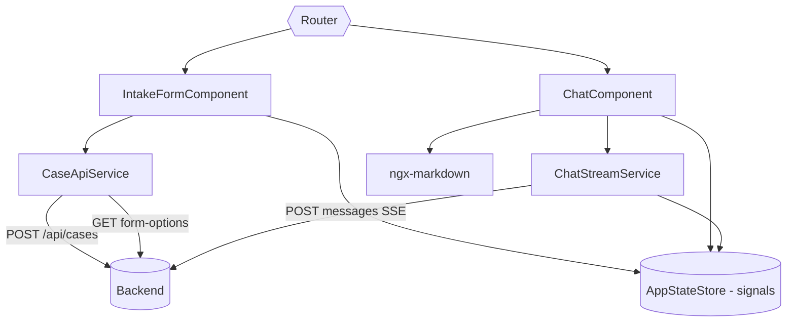

# ADR-002: Frontend (Angular + Angular Material)

**Date:** 2026-06-24
**Status:** Accepted
**Relates to:** [`000-main-architecture.md`](000-main-architecture.md)

---

## 1. Scope

Covers the Angular SPA: project setup, the two screens (intake form, chat), the single-image upload + preview, SSE consumption for streamed chat, markdown rendering, state management, and responsiveness. **Does not cover** backend endpoints (see [`001-backend.md`](001-backend.md)) or prompts (see [`003-llm-integration.md`](003-llm-integration.md)).

---

## 2. Context7 References

| Library | Context7 Handle | Used for |
|---|---|---|
| Angular | `/angular/angular` | SPA framework, signals, control flow, zoneless |
| Angular Material / CDK | `/angular/components` | UI primitives, CDK scroll |
| ngx-markdown | `/jfcere/ngx-markdown` | Render markdown decision/chat messages |

---

## 3. Component Design

Standalone, signal-first, zoneless Angular 22 app. Two routed screens plus shared services.

- **AppStateStore** (`providedIn: 'root'`, signals) — holds `sessionId`, `caseSummary`, `currentDecisionCategory`, `messages[]`, `isStreaming`. Single source of truth shared by both screens; survives in-app navigation, not page reload (matches PRD §9.2).
- **IntakeFormComponent** — reactive form (Signal Forms or Reactive Forms) with: request-type select (toggles reason-required), equipment-category select (populated from `GET /api/meta/form-options`), name input, date picker (future dates disabled), reason textarea (required for complaints), single-image upload with thumbnail preview and client-side type/size validation. On submit: disable form, show loading, POST multipart; on success store session + navigate to chat; on error show retry banner and stay.
- **ChatComponent** — header (case summary + decision badge), scrollable message list (user vs assistant bubbles; assistant rendered as markdown), input + send button. Sends via `ChatStreamService`; appends streamed tokens to the in-progress assistant bubble; auto-scrolls (CDK); updates the decision badge if the stream reports a category change; disables send while streaming/empty.
- **CaseApiService** — `submitCase(formData)` (multipart POST), `getFormOptions()`.
- **ChatStreamService** — `sendMessage(text)`: POSTs to `/api/sessions/{id}/messages` via `fetch` + `ReadableStream`, parses SSE frames, updates `AppStateStore` signals incrementally; `AbortController` for cleanup.

### Chat UI: built from Material primitives (no chat library)
No actively-maintained, Angular-Material-native chat component library exists (see §6). The chat is assembled from `mat-card`/`mat-list` (bubbles), `mat-form-field`+`matInput`+`mat-icon-button` (input/send), `@angular/cdk/scroll` (auto-scroll), `ngx-markdown` (assistant content), and signals (message buffer). This is a small amount of code and gives full control over incremental streaming rendering.

---

## 4. Data Structures

- **Message**: `{ role: 'user' | 'assistant' | 'system', content: string }` — assistant content is markdown.
- **CaseSummary**: `{ requestType, equipmentCategory, equipmentName, decisionCategory }`.
- **FormOptions**: `{ requestTypes: {value,labelPl}[], equipmentCategories: {value,labelPl}[] }`.
- **SubmitResult**: `{ sessionId, decisionCategory, firstMessageMarkdown, caseSummary }`.

All labels rendered to the user are Polish (from the backend metadata endpoint or local Polish constants).

---

## 5. Interface Contracts

Consumes backend endpoints (see main ADR §6):
- `GET /api/meta/form-options` → populate selects.
- `POST /api/cases` (multipart) → `SubmitResult`; map `400` field errors to form fields, `5xx` to retry banner.
- `POST /api/sessions/{id}/messages` (SSE via fetch) → incremental tokens; terminal `[DONE]`; optional `{decisionCategory}` event updates the badge.
- `GET /api/sessions/{id}` → optional state recovery.

SSE parsing contract: read the response body stream, decode, split on blank-line frame boundaries, extract `data:` lines, append text tokens, react to `[DONE]` and JSON state frames.

---

## 6. Technical Decisions

### Build chat from Material primitives (no chat component library)
**Status:** Accepted
**Date:** 2026-06-24
**Context:** The chat is the core UI; PRD needs streamed bubbles, markdown, a decision badge.
**Decision:** Compose the chat from Angular Material + CDK primitives + ngx-markdown + signals.
**Rejected alternatives:**
- *stream-chat-angular* — active but requires a paid Stream.io backend; not Material-styled.
- *@syncfusion/ej2-angular-interactive-chat* — has streaming AI view but is commercially licensed; over-engineered for a 2-screen MVP.
- *ng-chat / angular-material-chat-ui / ngx-material-file-input* — abandoned (Angular 7–8 era).
- *Nebular chat* — Eva Design System, conflicts with Material.
**Consequences:** (+) Zero paid/abandoned deps, full streaming control, Material-consistent. (−) ~150 lines of custom UI to own.
**Review trigger:** If chat requirements grow (threads, attachments, reactions) beyond simple Q&A.

### SSE via `fetch` + `ReadableStream` (not `EventSource`)
**Status:** Accepted
**Date:** 2026-06-24
**Context:** Each chat turn is a POST (message body) to a session URL; native `EventSource` is GET-only and cannot send a body or custom headers.
**Decision:** Consume the SSE stream with `fetch` + `ReadableStream`, updating signals as tokens arrive; `AbortController` on component destroy.
**Rejected alternatives:** *EventSource* — cannot POST; would require encoding state in the URL and a side channel. *WebSocket* — heavier than needed (backend chose SSE).
**Consequences:** (+) Clean POST+stream, zoneless-friendly signal updates, no extra dependency. (−) Manual SSE frame parsing (~40 lines).
**Review trigger:** If automatic reconnection/resume becomes a requirement.

### ngx-markdown for assistant messages
**Status:** Accepted
**Context:** The decision message and chat replies are formatted markdown (PRD §9.2).
**Decision:** Use ngx-markdown 22 via `provideMarkdown()`; render assistant bubbles with the `<markdown>` component; render user text as plain text.
**Rejected alternatives:** *marked + bypassSecurityTrustHtml* — saves a few KB but loses Angular integration and adds sanitization burden.
**Consequences:** (+) Maintained, Angular-version-tracked, MIT. (−) One dependency (`marked` transitive).
**Review trigger:** If markdown needs (math, mermaid) change materially.

### Native file input + FileReader for upload/preview
**Status:** Accepted
**Context:** Single JPEG/PNG ≤5MB with thumbnail preview; Material has no file-input; the Material file-input libs are abandoned.
**Decision:** Hidden `<input type="file">` triggered by a Material icon button; validate type/size client-side; `FileReader.readAsDataURL` for preview; send the file via multipart.
**Rejected alternatives:** *ngx-material-file-input* etc. — abandoned/stale.
**Consequences:** (+) No fragile dependency, full control. (−) ~20 lines of code.
**Review trigger:** If multi-file or drag-drop upload is needed.

---

## 7. Diagrams

### Component diagram


### Sequence — streamed chat in the UI
```mermaid
sequenceDiagram
    participant U as User
    participant CH as ChatComponent
    participant S as ChatStreamService
    participant ST as AppStateStore
    participant BE as Backend
    U->>CH: type + send
    CH->>S: sendMessage(text)
    S->>ST: push user msg + empty assistant msg, isStreaming=true
    S->>BE: fetch POST /messages (ReadableStream)
    loop SSE frames
        BE-->>S: data: <token>
        S->>ST: append token to last assistant msg
        ST-->>CH: signal change -> re-render (markdown)
    end
    BE-->>S: data: {decisionCategory?}; data: [DONE]
    S->>ST: isStreaming=false; update badge if changed
```

---

## 8. Testing Strategy

### Test scenarios for this area

| Scenario | Type | Input | Expected output | Edge cases |
|---|---|---|---|---|
| Reason required toggles | Unit (Karma/Jasmine) | switch request type | reason required for complaint, optional for return | switching back |
| Image type/size validation | Unit | GIF; 6MB; valid PNG | Polish error / accepted + preview | exactly 5MB |
| Future date blocked | Unit | tomorrow | field invalid, submit disabled | today valid |
| Submit success → navigate | Unit | valid form, mocked API | navigates to chat, first bubble rendered | — |
| Submit error → retry | Unit | mocked 503 | stays on form, retry banner | retry succeeds |
| SSE incremental render | Unit | mocked stream of tokens | assistant bubble grows; markdown rendered | mid-stream abort on destroy |
| Decision badge update | Unit | stream emits ESCALATE | header badge updates | no change frame |
| Empty input | Unit | blank message | send disabled | whitespace only |
| Responsive layout | E2E (Playwright) | mobile + desktop viewports | no horizontal scroll; usable | small screens |
| Full flow | E2E (Playwright) | real backend | form→decision→chat reply | — |

### Technical acceptance criteria
- **TAC-201:** Client-side validation blocks submit and shows Polish field errors for: missing image, non-JPEG/PNG, >5MB, missing complaint reason, future date.
- **TAC-202:** The assistant bubble updates incrementally as SSE tokens arrive (asserted with a mocked stream).
- **TAC-203:** Navigating away / destroying the chat component aborts the in-flight fetch stream (no dangling reads).
- **TAC-204:** The decision badge reflects a category change delivered in the stream's state frame.
- **TAC-205:** `ng build` (production) and unit tests pass on Node 24.
- **TAC-206:** Layout has no horizontal page scroll at 360px and desktop widths (Playwright).
- **TAC-207:** All user-facing strings are Polish.
