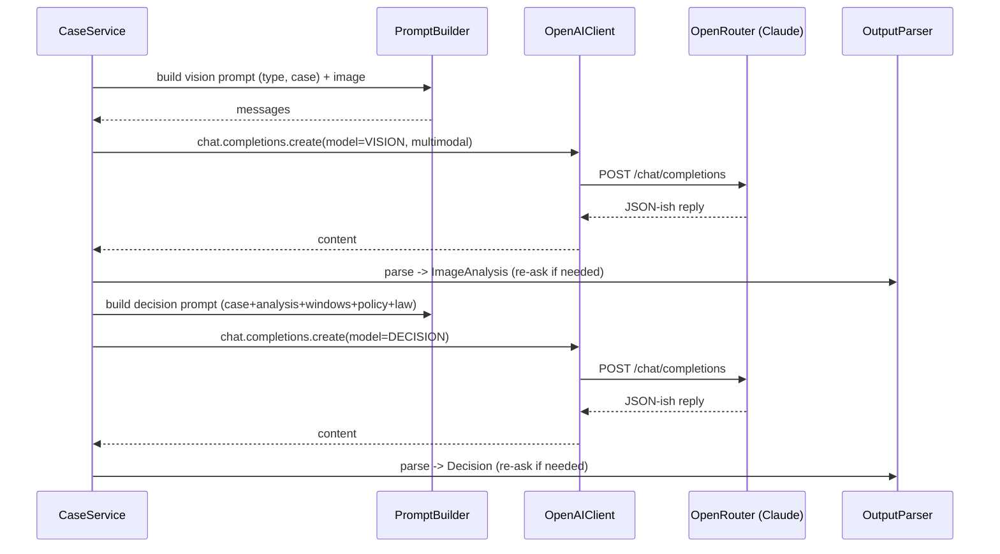

# ADR-003: LLM Integration (openai-java + OpenRouter)

**Date:** 2026-06-24
**Status:** Accepted
**Relates to:** [`000-main-architecture.md`](000-main-architecture.md)

---

## 1. Scope

Covers how the backend talks to the LLM: SDK choice and configuration, the **Chat Completions vs Responses API** decision, model selection, the multimodal analysis call, the decision call, the streamed chat call, structured-output handling, prompt specifications, and error/retry behavior. **Does not cover** controller/service wiring (see [`001-backend.md`](001-backend.md)).

---

## 2. Context7 References

| Library | Context7 Handle | Used for |
|---|---|---|
| openai-java | `/openai/openai-java` | Client, Chat Completions, vision content parts, streaming |
| Jackson | `/fasterxml/jackson` | Parse model JSON output |

External docs: OpenRouter Quickstart, App Attribution, and Responses-API overview (`https://openrouter.ai/docs/...`).

---

## 3. Component Design

A single integration module wraps the SDK so the rest of the app depends on a narrow interface (`analyzeImage`, `decide`, `streamChat`).

- **Clients (config beans):** a synchronous `OpenAIClient` (analysis + decision) and an asynchronous `OpenAIClientAsync` (streamed chat), both built with `OpenAIOkHttpClient[.Async].builder().baseUrl(OPENROUTER_BASE_URL).apiKey(OPENROUTER_API_KEY).build()`.
- **Attribution headers:** OpenRouter's optional `HTTP-Referer` and `X-Title` are set **per request** via `putAdditionalHeader(...)` on the params builder (the client builder does not expose default headers); values from `APP_PUBLIC_URL` / `APP_TITLE`.
- **PromptBuilder:** assembles system + user content from prompt templates (in resources), injecting the selected policy document text, the legal-rules summary, the form data, the eligibility windows, and (for the decision) the image-analysis result.
- **OutputParser:** extracts the JSON object from the model reply (tolerant to surrounding prose / code fences) and maps it to `ImageAnalysis` / `Decision` via Jackson; on failure, one re-ask with a stricter instruction; on repeated failure, analysis → LOW-confidence/uncertain (drives ESCALATE), decision → propagate error (`502`, no partial decision).

---

## 4. Data Structures

- **Vision response JSON** (analyzer): complaint variant `{ damaged, damageType, damageLocation, likelyCause, confidence, summary }`; return variant `{ resellableAsNew, signsOfUse, missingElements, packagingDamage, confidence, summary }`. Tri-state fields use `"true" | "false" | "uncertain"`.
- **Decision response JSON:** `{ category: "APPROVE"|"REJECT"|"ESCALATE", justification, nextSteps, citedRules: [] }`. The user-facing `firstMessageMarkdown` is assembled by the backend from these fields plus the greeting and the mandatory disclaimer — the model is also asked to produce well-formed Polish markdown for `justification`/`nextSteps`.
- **Chat stream:** free-form Polish markdown tokens (no JSON). An out-of-band rule lets the backend detect/confirm a REJECT→ESCALATE transition (the system prompt instructs the model to emit a explicit marker line the backend strips, or the backend re-runs a lightweight classification — see §6).

---

## 5. Interface Contracts

| Method | Input | Output | API used |
|---|---|---|---|
| `analyzeImage` | requestType, caseData, base64 data-URL image | `ImageAnalysis` | Chat Completions, synchronous `create`, multimodal user content |
| `decide` | requestType, caseData, analysis, windows, policyText | `Decision` | Chat Completions, synchronous `create` |
| `streamChat` | session context (history, case, analysis, decision), user message; callbacks onChunk/onComplete/onError | streamed tokens | Chat Completions, `createStreaming` (async client) |

Vision input is a `data:image/jpeg;base64,<...>` URL placed in an image content part (`ChatCompletionContentPartImage` / `ImageUrl`), combined with a text content part in one user message.

---

## 6. Technical Decisions

### Chat Completions API over Responses API
**Status:** Accepted
**Date:** 2026-06-24
**Context:** openai-java exposes `client.responses()` and `client.chat().completions()`. OpenRouter's Responses API is explicitly **beta** ("breaking changes possible; use with caution in production"); Chat Completions is stable and well-exercised for Anthropic models through OpenRouter. OpenRouter is **stateless** under both APIs, so the Responses API's server-side conversation-state feature is not available here anyway.
**Decision:** Use the Chat Completions API for all three calls. Send full conversation context each chat turn (we hold it in the session store).
**Rejected alternatives:** *Responses API* — beta on OpenRouter, no functional gain for this app, risky during a live course demo; some params silently ignored for non-OpenAI models.
**Consequences:** (+) Stability, documented vision + streaming, provider-agnostic. (−) We manage history ourselves (already required).
**Review trigger:** OpenRouter marks the Responses API stable **and** we need a feature it uniquely provides.

### Prompt-instructed JSON + Jackson (not SDK schema binding)
**Status:** Accepted
**Date:** 2026-06-24
**Context:** `responseFormat(Class<T>)` uses OpenAI native structured outputs; reliable pass-through to Claude via OpenRouter is unconfirmed (OpenRouter silently drops unsupported params).
**Decision:** Instruct the model to return strict JSON (analyzer, decision) and parse with Jackson; tolerant extraction + one re-ask; on persistent failure, analyzer degrades to uncertain→ESCALATE, decision returns error. Chat replies are plain markdown (no JSON).
**Rejected alternatives:** *SDK structured output* — not dependable for this model/gateway combo.
**Consequences:** (+) Works with any model. (−) Parsing/retry code to own and test.
**Review trigger:** Reliable schema-constrained output becomes available through OpenRouter for Claude.

### Two-step pipeline: analyze, then decide (separate calls)
**Status:** Accepted
**Context:** PRD separates the multimodal analyzer (condition assessment, no verdict) from the reasoning decision agent (verdict + justification).
**Decision:** Two sequential Chat Completions calls; the analyzer's structured result is injected into the decision prompt. Keeps roles single-purpose and testable.
**Rejected alternatives:** *Single multimodal+reasoning call* — couples concerns, harder to test/iterate prompts, weaker control over the "analyzer must not decide" rule.
**Consequences:** (+) Clear separation, independently tunable prompts. (−) Two calls (latency/cost); acceptable for MVP.
**Review trigger:** If latency/cost pressure favors merging.

### Escalation transition detection in chat
**Status:** Accepted
**Context:** PRD AC-25: chat may move REJECT→ESCALATE on credible new info, never REJECT→APPROVE.
**Decision:** The chat system prompt forbids upgrading to APPROVE and instructs the model, when it decides escalation is warranted, to include a machine-detectable marker the backend strips from the visible text and uses to update `currentDecisionCategory`.
**Rejected alternatives:** *Post-hoc re-classification call every turn* — extra latency/cost; *no detection* — badge can't update reliably.
**Consequences:** (+) Cheap, deterministic state update. (−) Relies on the model honoring the marker (covered by tests + guardrail: APPROVE markers are ignored).
**Review trigger:** If marker reliability proves insufficient.

### Model selection (Claude via OpenRouter), env-overridable
**Status:** Accepted
**Context:** Strong multimodal + reasoning needed; team chose Claude via OpenRouter.
**Decision:** Default `anthropic/claude-sonnet-4.6` for both `LLM_MODEL_VISION` and `LLM_MODEL_DECISION`; overridable per role via env. `anthropic/claude-sonnet-latest` available as an auto-tracking alias.
**Rejected alternatives:** *Pin a dated snapshot* — staler; *separate vision/reasoning models* — unnecessary now (one model handles both well).
**Consequences:** (+) Simple, high quality, swappable. (−) Cost tied to one provider (mitigated by OpenRouter routing + env override).
**Review trigger:** Quality/cost change, or a materially better model appears.

---

## 7. Prompt Specifications

Prompts are externalized templates (Polish output required). Each forbids inventing facts/clauses and requires explicit uncertainty. Exact wording is owned by implementation; required intent and output shape below.

### 7.1 Vision — Complaint analysis
- **Inputs:** image (data URL), equipment category + name, customer reason.
- **Task:** determine whether the item is damaged; the damage type and location; the most likely cause, **distinguishing user-inflicted/accidental damage from manufacturing defects or normal wear**; flag low-confidence/ambiguous/unusable images.
- **Must not:** decide the complaint outcome; speculate beyond what's visible.
- **Output:** JSON `{ damaged, damageType, damageLocation, likelyCause, confidence, summary }` (Polish strings).

### 7.2 Vision — Return analysis
- **Inputs:** image, equipment category + name, optional reason.
- **Task:** determine whether the item appears **undamaged and resellable as new**; identify visible signs of use/wear, missing elements, packaging damage; flag low-confidence/unusable images.
- **Must not:** decide the return outcome.
- **Output:** JSON `{ resellableAsNew, signsOfUse, missingElements, packagingDamage, confidence, summary }`.

### 7.3 Decision — Complaint
- **Inputs:** form data, complaint `ImageAnalysis`, eligibility windows (esp. 2-year non-conformity), **complaint policy document text**, legal-rules summary (non-conformity 2y, remedy order, 14-day seller response, gwarancja).
- **Task:** choose `APPROVE | REJECT | ESCALATE`; justify citing the specific policy clause(s) and/or legal basis; give concrete next steps; escalate on ambiguity/low-confidence image/conflicting data/borderline policy fit; reject (with alternatives) when clearly outside policy/law (e.g., user-inflicted damage, out of 2-year window).
- **Output:** JSON `{ category, justification, nextSteps, citedRules }` (Polish markdown in `justification`/`nextSteps`).

### 7.4 Decision — Return
- **Inputs:** form data, return `ImageAnalysis`, eligibility windows (esp. 14-day withdrawal), **return policy document text**, legal-rules summary (14-day withdrawal, value-reduction for use beyond inspection).
- **Task:** choose `APPROVE | REJECT | ESCALATE`; approve if within 14 days and resellable; reject if out of window or clear signs of use (offer reklamacja path if defect); escalate on ambiguity/borderline value-reduction.
- **Output:** JSON `{ category, justification, nextSteps, citedRules }`.

### 7.5 First message assembly (backend, not the model)
The backend composes `firstMessageMarkdown` = greeting → decision (with Polish label: *Zatwierdzono wstępnie* / *Odrzucono* / *Przekazanie do konsultanta*) → justification → next steps → **mandatory disclaimer** (PRD §11.6 wording). Guarantees AC-21/AC-22 regardless of model output.

### 7.6 Chat system prompt
- Full context: form data, image analysis, the first decision, prior turns.
- Rules (PRD §11.4): may clarify, may move REJECT→ESCALATE on credible new info (emit the escalation marker), **never** REJECT→APPROVE, never invent clauses/law, never present as binding, decline off-topic and redirect, Polish, plain language.

---

## 8. Diagrams

### Integration sequence (analysis → decision)


### Streamed chat
```mermaid
sequenceDiagram
    participant CHS as ChatService
    participant CA as OpenAIClientAsync
    participant OR as OpenRouter
    participant EM as SseEmitter
    CHS->>CA: chat.completions.createStreaming(history+rules)
    CA->>OR: POST /chat/completions (stream)
    loop chunks
        OR-->>CA: ChatCompletionChunk
        CA-->>CHS: onChunk(delta)
        CHS->>EM: emit data: <token> (strip escalation marker)
    end
    OR-->>CA: end
    CHS->>EM: emit {decisionCategory?} then [DONE]; complete()
```

---

## 9. Testing Strategy

The LLM is mocked at the HTTP boundary (MockWebServer) for integration tests; OutputParser and PromptBuilder are unit-tested in isolation.

### Test scenarios

| Scenario | Type | Input | Expected | Edge cases |
|---|---|---|---|---|
| Vision prompt selection | Unit | requestType COMPLAINT vs RETURN | correct template + fields | — |
| Multimodal request shape | Integration (mock) | image + text | request contains image part with `data:image/...;base64,` URL | large image (still ≤ limit) |
| Parse clean JSON | Unit | well-formed JSON reply | mapped `ImageAnalysis`/`Decision` | JSON in code fence / with prose |
| Re-ask on malformed | Integration (mock) | first reply not JSON, second clean | one re-ask, then success | both malformed → analyzer uncertain / decision 502 |
| Decision category mapping | Unit | each category string | correct enum; unknown → ESCALATE | lowercase/whitespace |
| Streaming relay | Integration (mock) | chunked stream | tokens forwarded; ends `[DONE]` | mid-stream error → onError |
| Escalation marker | Unit | reply with marker | marker stripped from text; category→ESCALATE | APPROVE marker ignored |
| Attribution headers | Integration (mock) | any call | `HTTP-Referer`/`X-Title` present when configured | unset → omitted |
| Model override | Unit | env overrides | request uses overridden model id | default applied |

### Technical acceptance criteria
- **TAC-301:** Every LLM request targets `OPENROUTER_BASE_URL` with the configured model id and Bearer auth.
- **TAC-302:** Multimodal requests include exactly one image content part as a base64 `data:` URL plus the text instruction.
- **TAC-303:** OutputParser extracts valid JSON from replies wrapped in prose or ```code fences```; malformed input triggers exactly one re-ask.
- **TAC-304:** An unparseable decision after re-ask yields `502` (no partial/blank decision); an unparseable analysis yields LOW confidence that drives `ESCALATE`.
- **TAC-305:** The streamed chat strips any escalation marker from user-visible text and updates `currentDecisionCategory` to `ESCALATE` only (never `APPROVE`).
- **TAC-306:** The Responses API is not invoked anywhere (Chat Completions only) — asserted by request-path inspection.
