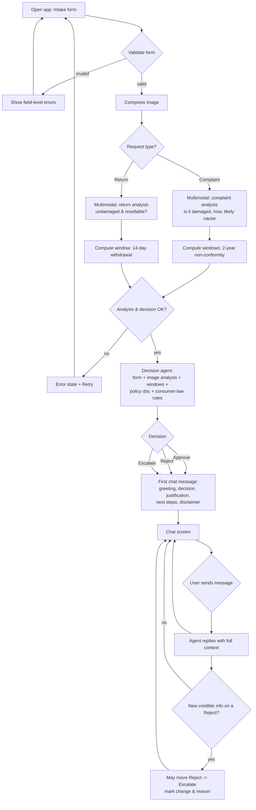

# PRD — Hardware Service Decision Copilot

> Status: MVP (Proof of Concept) — course project for the "AI dla programistów — od pomysłu do MVP" training (NBP edition).
> This document covers functionality, system behavior, UX and UI only. Architecture and technology choices are defined separately in the ADR.

---

## 1. Executive Summary

Hardware Service Decision Copilot is a self-service web application that helps a customer decide whether their electronics **complaint** (reklamacja) or **return** (zwrot) is likely to be accepted, and what to do next. The customer fills a short form, uploads one photo of the equipment, and receives an AI-generated decision (**Approve / Reject / Escalate to a human consultant**) with a clear, policy-based justification, followed by a chat where they can ask questions or add information. This is an MVP: it produces an **advisory, non-binding** recommendation grounded in the company's complaint/return policy and Polish consumer law, not a final legal ruling.

---

## 2. Problem Statement

When a customer wants to complain about or return electronics, they currently do not know whether their case qualifies. They must read long policy documents and statutory rules (the 14-day right of withdrawal for distance contracts, the 2-year seller liability for non-conformity, voluntary manufacturer guarantees), judge whether the product's condition disqualifies the request, and often wait in a support queue only to be told their request does not meet the rules. Support staff, in turn, spend time on repetitive first-line triage of cases that could be pre-assessed automatically. There is no fast, consistent, self-service way to get an explained, policy-grounded preliminary assessment before contacting support.

---

## 3. Users / Personas

### Persona 1 — Anna, individual consumer (primary)
Bought a laptop online 9 months ago; the keyboard started failing. She is not a lawyer and does not know the difference between *reklamacja*, *gwarancja* and *odstąpienie od umowy*. She wants to know, in plain Polish, whether she can complain, what evidence matters, and what happens next — without waiting on the phone.

### Persona 2 — Marek, "changed my mind" returner (primary)
Bought a monitor 6 days ago, unopened-but-used a little, decided he doesn't need it. He wants to return it for a refund under the 14-day distance-sale right. He needs to know whether the item's condition (signs of use) still allows a return.

### Persona 3 — Support consultant (indirect beneficiary, escalation target)
Does not operate the app in the MVP. Receives **escalated** cases enriched with the customer's form data, the photo analysis, and the AI's reasoning, so first-line triage is faster. (Full consultant tooling is out of scope — see Section 7 and the backlog in Section 12.)

---

## 4. Main Flows

### 4.1 Happy path — Complaint, Approve
1. Customer opens the app and lands on the **intake form**.
2. Customer selects request type = **Reklamacja (complaint)**.
3. Customer selects equipment category, enters model/name, picks date of purchase, writes a reason (**mandatory for complaints**), and uploads one photo (required).
4. Customer submits. The system validates all fields client- and server-side.
5. The system **compresses the image** and sends it to the multimodal model for analysis using the **complaint analysis prompt** (assess whether/how it is damaged and the likely cause).
6. The system computes the **eligibility windows** from the purchase date (14-day withdrawal window; 2-year non-conformity window).
7. The decision agent receives: form data, the image analysis, the computed windows, and the **complaint policy document** + Polish consumer-law rules. It produces a decision = **Approve**, with justification and next steps.
8. The customer is taken to the **chat screen**. The first message (system/agent bubble) contains: greeting, the decision, the justification, the next steps, and the mandatory advisory disclaimer — nicely formatted.
9. Customer may ask follow-up questions; the agent answers within scope, retaining the full context (form data, image analysis, first decision message, and the chat so far).

### 4.2 Happy path — Return, Approve
1–4. As above, but request type = **Zwrot (return)**. The reason textarea is **optional** for returns.
5. The system sends the image to the multimodal model using the **return analysis prompt** (assess whether the item is undamaged and resellable as new — no signs of use).
6. The system computes whether the request is inside the **14-day withdrawal window**.
7. The decision agent receives form data, image analysis, window status, and the **return policy document** + consumer-law rules, and produces **Approve** with justification and next steps (e.g., how to ship the item back).
8–9. As in 4.1.

### 4.3 Alternative path — Reject
- The agent determines the case does not meet policy/law (e.g., complaint photo shows clear user-inflicted mechanical damage; or return photo shows heavy signs of use; or the request is outside the relevant window).
- Decision = **Reject**. The first chat message states the decision, the specific reasons, the relevant policy/law clause, and what alternatives the customer has (e.g., paid repair, contacting support to dispute).
- In chat, the agent **cannot upgrade a Reject to Approve automatically** (see Section 11). If the customer provides credible new information, the agent may move the case toward **Escalate**.

### 4.4 Alternative path — Escalate to a human consultant
- The agent determines it cannot make a confident decision: the image is ambiguous/unusable, the form data conflicts, the case is borderline against policy, or required information is missing and cannot be resolved in chat.
- Decision = **Escalate**. The first chat message explains why a human consultant is needed and what the customer should prepare/expect. (Actual hand-off/routing to a real consultant is out of scope for the MVP — the app states that the case would be escalated.)

### 4.5 Error path — Image analysis or decision unavailable
- If image compression/analysis or the decision step fails (model/service error, timeout), the system shows an error state on the form with a retry option and does not navigate to chat. No partial/blank decision is shown.

### 4.6 Error path — Validation failure
- If any required field is missing/invalid (including: missing image, wrong image format, image too large, missing reason for a complaint, future purchase date), the form blocks submission and shows a field-level message. No request is sent to the model.

---

## 5. User Stories

1. **Happy path (complaint).** As a consumer, I want to submit my faulty laptop's details and a photo, so that I get an explained decision on whether my complaint qualifies without calling support.
2. **Happy path (return).** As a consumer who changed their mind, I want to check whether my lightly-used monitor can still be returned within 14 days, so that I don't ship it back only to have it refused.
3. **Mandatory reason for complaints.** As a consumer filing a complaint, I want the form to require a description of the problem, so that the assessment is based on the actual defect.
4. **Invalid input.** As a consumer, I want clear messages when my photo is the wrong format/too large or a required field is empty, so that I can fix it before submitting.
5. **Service unavailable.** As a consumer, I want to be told when the assessment cannot be completed right now and be able to retry, so that I am not shown a blank or wrong decision.
6. **Ambiguous case.** As a consumer with a borderline case, I want the agent to escalate to a human and explain why, rather than guess, so that I get a fair review.
7. **Follow-up questions.** As a consumer, I want to ask the agent follow-up questions in chat with my case context retained, so that I understand my next steps.
8. **New information in chat.** As a consumer who was rejected, I want to add information in chat, so that the agent can re-evaluate toward a human review if warranted (without it silently flipping to Approve).
9. **Plain-language law.** As a non-expert consumer, I want the decision to reference the relevant rules (e.g., 14-day withdrawal, 2-year non-conformity, guarantee) in plain Polish, so that I understand the basis of the decision.

---

## 6. Acceptance Criteria

### Form
- **AC-01** The form provides a request-type selector with exactly two options: *Reklamacja* (complaint) and *Zwrot* (return).
- **AC-02** The form provides an equipment-category selector with a predefined list (see Section 8 — Functional).
- **AC-03** The form provides a free-text input for equipment name/model (required, non-empty after trimming).
- **AC-04** The form provides a date picker for date of purchase; dates in the future are rejected with a field-level error.
- **AC-05** The reason textarea is **required when request type = complaint** and **optional when request type = return**; the requirement updates immediately when the request type changes.
- **AC-06** The form requires exactly one image upload; submission is blocked if no image is attached.
- **AC-07** The system rejects images that are not JPEG or PNG with a field-level error and does not send them to the model.
- **AC-08** The system rejects images larger than 5 MB (pre-compression) with a field-level error stating the limit.
- **AC-09** Submission is blocked and field-level errors are shown if any required field is invalid; no analysis request is sent in that case.

### Image analysis
- **AC-10** On valid submission, the backend compresses the image before sending it to the multimodal model.
- **AC-11** For a complaint, the multimodal model is prompted to assess whether the item is damaged, the type/location of damage, and the likely cause (e.g., user-inflicted vs. manufacturing/wear).
- **AC-12** For a return, the multimodal model is prompted to assess whether the item appears undamaged and resellable as new (presence/absence of signs of use).
- **AC-13** If image analysis fails, the user sees an error state with a retry action and is not navigated to chat.

### Eligibility windows
- **AC-14** The system computes elapsed time from the purchase date and determines: (a) whether the request is within the 14-day withdrawal window (relevant to returns) and (b) whether it is within the 2-year seller-liability window for non-conformity (relevant to complaints).
- **AC-15** A return request submitted outside the 14-day window biases the decision toward **Reject** or **Escalate**, and the out-of-window status is stated in the justification.
- **AC-16** A complaint submitted outside the 2-year window biases the decision toward **Reject** or **Escalate**, and the out-of-window status is stated in the justification.

### AI decision
- **AC-17** The decision agent returns exactly one of three categories: **Approve**, **Reject**, or **Escalate to a human consultant**.
- **AC-18** The decision uses the complaint policy document for complaints and the return policy document for returns, plus the relevant Polish consumer-law rules.
- **AC-19** Every decision includes a justification that references the specific policy clause(s) and/or legal basis it relied on.
- **AC-20** Every decision includes concrete next steps appropriate to the category.
- **AC-21** Every decision message includes the mandatory advisory/non-binding disclaimer (see Section 11).
- **AC-22** The first chat message is a single agent bubble containing, in order: greeting, decision, justification, next steps, and disclaimer.

### Chat
- **AC-23** After the decision, the user can send free-text messages and receives agent replies.
- **AC-24** The agent's context includes the full form data, the image analysis result, the first decision message, and all prior chat turns in the session.
- **AC-25** In chat, the agent must not change a **Reject** into an **Approve**; it may, on credible new information, move a Reject toward **Escalate**, clearly marking that the assessment has changed and why.
- **AC-26** The agent declines off-topic requests and redirects to the complaint/return topic (see Section 11).
- **AC-27** All user-facing text (form labels, validation messages, decisions, chat) is in Polish.

### General
- **AC-28** No decision is shown unless both image analysis and the decision step completed successfully.
- **AC-29** Supported on current desktop and mobile versions of major browsers (Chrome, Firefox, Edge, Safari); responsive layout for mobile.

---

## 7. Out of Scope

- **Authentication / user accounts.** No login, registration, or identity verification in the MVP.
- **Real consultant hand-off.** "Escalate" informs the user; it does not route the case to a real human, queue, or ticketing system.
- **Persistence of sessions and decisions.** Sessions, decisions, and actions are not stored in a database in the MVP (planned — see Section 12).
- **Customer / purchase-history lookup.** No retrieval of existing customer records or order history (planned — see Section 12).
- **RAG knowledge base.** No retrieval-augmented knowledge base of electronics specs/procedures (planned — see Section 12).
- **Admin / back-office UI.** No interface to manage policies, categories, or review past cases.
- **Notifications.** No email/SMS/push notifications.
- **Payments, refunds, shipping label generation.** The app advises; it does not execute refunds or generate return logistics.
- **Multiple image uploads, video, or documents.** Exactly one image; no invoices/receipts upload in the MVP.
- **Multilingual UI.** Polish only.
- **Native mobile apps.** Web only (responsive).
- **Binding decisions.** Output is advisory; it is not a legally binding decision on the complaint/return.

---

## 8. Constraints

### Business
- The decision is **advisory and non-binding**; the company's final decision and statutory consumer rights are unaffected. This must be stated in every decision.
- Decisions must be grounded in the company's published complaint/return policy documents and must not contradict mandatory Polish consumer law.
- The app must not collect more personal data than the form requires; in the MVP no personal identity data is requested beyond what the user voluntarily types into free-text fields.

### Functional
- **Request types:** exactly two — *Reklamacja* (complaint), *Zwrot* (return).
- **Equipment categories (IT/computing-focused):** Laptopy; Komputery stacjonarne; Monitory; Peryferia (klawiatury/myszy); Komponenty PC; Sieci (routery); Akcesoria; Inne.
- **Image:** exactly one file; formats **JPEG or PNG only**; maximum **5 MB** before compression; the backend compresses before sending to the multimodal model.
- **Reason field:** required for complaints, optional for returns.
- **Date of purchase:** must not be in the future; used to compute eligibility windows.
- **Language:** all user-facing text in Polish.
- **Decision categories:** Approve / Reject / Escalate to a human consultant.
- **Browsers/devices:** current desktop and mobile Chrome, Firefox, Edge, Safari; responsive.

### Legal reference facts (verified, June 2026)
These inform the rules the agent applies; they are summarized for product behavior, not as legal advice.
- For consumer (B2C) sales, **rękojmia was replaced by "brak zgodności towaru z umową"** from 1 January 2023 (Ustawa o prawach konsumenta). The seller is liable for non-conformity for **2 years** from delivery.
- Consumer remedies for non-conformity follow an order: **repair or replacement** first; **price reduction or withdrawal** if non-conformity is significant or repair/replacement is impossible/unreasonable.
- The seller must respond to a complaint within **14 days**; failure to respond means the complaint is deemed accepted.
- For distance/off-premises contracts, the consumer has a **14-day right of withdrawal** (return without giving a reason); the item may show only the handling necessary to establish its nature/characteristics/functioning.
- **Gwarancja** (guarantee) is a **voluntary** statement by the guarantor (manufacturer/importer/distributor/seller) and is independent of the statutory non-conformity remedy.

### External document / data references
| Document | Path | When it is used |
|---|---|---|
| Complaint policy (Regulamin reklamacji) | `docs/policies/regulamin-reklamacji.md` | Injected into the decision agent for **complaint** requests |
| Return policy (Regulamin zwrotów) | `docs/policies/regulamin-zwrotow.md` | Injected into the decision agent for **return** requests |

---

## 9. UI Description (wireframe level)

### 9.1 Screen 1 — Intake form
**Layout (top to bottom):**
- Page title and a one-line subtitle stating the app gives an advisory assessment.
- **Request type** selector (two options: Reklamacja / Zwrot). Changing it dynamically toggles whether the reason field is required.
- **Equipment category** dropdown (predefined list).
- **Name / model** text input.
- **Date of purchase** date picker (future dates disabled/rejected).
- **Reason** textarea, with a label that indicates required (complaint) or optional (return) depending on the current request type.
- **Image upload** control: single file, accepts JPEG/PNG, shows a thumbnail preview and file name once selected, with a remove/replace action.
- **Submit** button.

**Interactive behavior:**
- Each field validates on blur and on submit; invalid fields show an inline message beneath them.
- Submit is enabled only when all required fields are valid; on click it shows a loading state.

**States:**
- *Empty state:* clean form, no errors, submit allowed only after required fields are filled.
- *Validation error state:* field-level messages (e.g., "Zdjęcie jest wymagane", "Dozwolone formaty: JPG, PNG", "Maksymalny rozmiar: 5 MB", "Opis jest wymagany dla reklamacji", "Data zakupu nie może być w przyszłości").
- *Loading state:* after submit, a progress indicator with text indicating the photo is being analyzed and the decision prepared; the form is disabled.
- *Error state:* if analysis/decision fails, an error banner with a **Retry** action; the user stays on the form.

**Navigation:** on success, the app transitions to the chat screen with the first decision message already present.

### 9.2 Screen 2 — Chat
**Layout:**
- A header showing the case summary (request type, category, model, decision badge: Approve / Reject / Escalate).
- A scrollable conversation area. The **first bubble** is the agent's decision message: greeting → decision → justification → next steps → disclaimer, formatted with clear sections.
- A message input box with a send button at the bottom.

**Interactive behavior:**
- The user types a message and sends it; the user's bubble appears, then the agent's reply streams/loads into a new bubble.
- The decision badge in the header reflects the latest assessment; if the agent moves a Reject to Escalate during chat, the badge updates and the change is explained in a bubble.

**States:**
- *Loading state:* a typing/loading indicator while the agent generates a reply.
- *Error state:* if a reply fails, an inline message with a retry for that message; prior conversation is preserved.
- *Empty input:* send is disabled when the input is empty.

**Navigation:** a way to start a new case (returns to a fresh intake form). Because sessions are not persisted in the MVP, leaving/refreshing discards the conversation.

---

## 10. User Flow Diagram

---

## 11. Agent / System Behavior Specification

### 11.1 Components
- **Multimodal analyzer** — examines the uploaded photo and returns a structured condition assessment. It does **not** make the final decision.
- **Decision agent** — a reasoning ("thinking") agent that combines the form data, the analyzer's output, the computed eligibility windows, the applicable policy document, and the consumer-law rules to produce the decision, justification, and next steps. It also conducts the subsequent chat.

### 11.2 Multimodal analyzer — required behavior
- **Complaint analysis prompt** must direct the model to determine: whether the item is damaged; the type and location of the damage; and the most likely cause, distinguishing user-inflicted/accidental damage from manufacturing defects or normal wear, and to flag low-confidence/ambiguous images.
- **Return analysis prompt** must direct the model to determine: whether the item appears undamaged and in resellable-as-new condition; whether there are visible signs of use, wear, missing elements, or packaging damage; and to flag low-confidence/ambiguous images.
- The analyzer must report uncertainty explicitly rather than guessing when the image is unusable or inconclusive.

### 11.3 Decision agent — role and purpose
Produce an advisory, policy-grounded preliminary assessment of the customer's complaint or return, communicated clearly in Polish, and answer follow-up questions within the scope of that case.

### 11.4 Allowed / not allowed
**Allowed:**
- Decide Approve / Reject / Escalate based strictly on the form data, image analysis, computed windows, the relevant policy document, and consumer-law rules.
- Cite the specific policy clause and/or legal basis used.
- Ask the user, in chat, for clarifying information.
- On credible new information for a previously **Reject**ed case, move the assessment to **Escalate**, stating clearly that the assessment changed and why.

**Not allowed:**
- Must not invent policy clauses, facts, or legal provisions not present in the injected rules.
- Must not present the decision as final or legally binding.
- Must not upgrade a **Reject** to **Approve** during chat.
- Must not request or store sensitive personal data beyond what the case requires.
- Must not give general legal advice unrelated to this complaint/return.

### 11.5 Decision categories and communication
- **Approve (Zatwierdzono wstępnie):** state that the case appears to meet policy/law, give the basis, and the next steps to proceed.
- **Reject (Odrzucono):** state the specific disqualifying reason(s) with the policy/legal basis, and offer alternatives (e.g., paid repair, contacting support to dispute, statutory rights that may still apply).
- **Escalate (Przekazanie do konsultanta):** state that a human consultant should review the case, why automated assessment is insufficient, and what the customer should prepare.

### 11.6 Mandatory disclaimer
Every decision message must include a Polish advisory disclaimer to the effect that the assessment is **preliminary and non-binding**, generated automatically, does **not** constitute a final decision on the complaint/return or legal advice, and does not limit the customer's statutory consumer rights. Example wording:
> *„Niniejsza ocena ma charakter wstępny i niewiążący. Została wygenerowana automatycznie i nie stanowi ostatecznej decyzji w sprawie reklamacji/zwrotu ani porady prawnej. Nie ogranicza ustawowych praw konsumenta."*

### 11.7 Off-topic / out-of-scope handling
If the user asks something unrelated to their complaint/return, the agent politely declines and redirects to the case at hand. It does not answer general-knowledge or unrelated questions.

### 11.8 Language and tone
- Language: **Polish** for all output.
- Tone: clear, polite, customer-facing, plain language; explains legal terms instead of assuming familiarity; concise and well-structured (short sections/bullets in the decision message).

---

## 12. Further Notes

### Planned backlog (deferred, but architecture should anticipate)
These are **out of scope for the MVP** but are intended near-term features; the architecture (ADR) should be designed so they can be added without rework:
1. **Session & decision persistence** — store every session with its form data, image analysis, decision, and all actions taken, for audit and later review.
2. **Customer & purchase-history lookup** — retrieve existing customer data and order history to enrich and pre-fill decisions.
3. **RAG knowledge base** — an internal retrieval-augmented knowledge base of electronics specifications and complaint/return procedures the agent can consult.
4. **Real consultant hand-off** — turn "Escalate" into an actual routed hand-off (ticket/queue) with the case context attached.

### Assumptions made
- The customer is the operator (self-service); decisions are shown directly to them with the advisory disclaimer.
- Example company policy documents are provided as starting content (`docs/policies/`) and are expected to be edited by the business; they are sample data, not authoritative legal text.
- Eligibility-window math uses the date of purchase as the reference for both the 14-day and 2-year windows for MVP simplicity; date of delivery is not collected in the MVP.

### Open questions (for ADR / later)
- Whether to collect the date of delivery (legally the 2-year window runs from delivery) in a later iteration.
- Exact escalation hand-off mechanism once persistence exists.
- Whether returns should support a fourth nuance ("accept with deduction for signs of use") in a future graded taxonomy.
